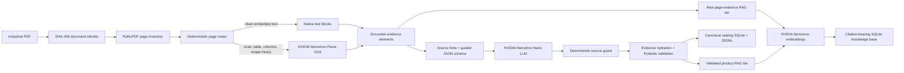

# Industrial Catalog Extractor

[](https://github.com/MohdMuzakkiruddinAhmed/Industrial-Catalog-Extractor/actions/workflows/ci.yml)
[](LICENSE)

[Offline demo](#quick-start-offline-reproducible-demo) · [Architecture](docs/ARCHITECTURE.md) · [Research report](docs/RESEARCH_REPORT.md) · [Deployment](docs/DEPLOYMENT.md)

An evidence-preserving NVIDIA VLM-to-RAG pipeline for industrial PDF catalogs.

The project routes each PDF page to native extraction or a document VLM, converts
the result into grounded evidence, asks a schema-constrained LLM for product data,
validates every citation, and builds a two-tier SQLite knowledge base. The core
design is fail-closed: successful inference is not enough for a claim to become
canonical; the claim must resolve to source evidence and pass deterministic guards.

> **Independent research software.** This repository is not an NVIDIA product and
> is not affiliated with or endorsed by NVIDIA. NVIDIA model weights are not
> distributed here and remain subject to their upstream licenses.

## What is included

- Complete Python extraction, parsing, validation, persistence, and retrieval code.
- OpenAI-compatible clients for NVIDIA Nemotron Parse, Nemotron Nano, and Nemotron
  embeddings.
- Deterministic dry-run mode that requires no GPU, API key, or network connection.
- Linux scripts for an eight-GPU NVIDIA server deployment, health monitoring, and
  bounded benchmark execution.
- 140+ unit and integration tests covering routing, parsing resilience, source
  guards, storage, citations, RAG, checkpoints, and operations scripts.
- Public-safe architecture documentation and the reviewed detailed report in Word
  and PDF.

Catalog PDFs, model weights, credentials, vector databases, run outputs, and
transfer archives are intentionally excluded from the runnable source. The original
`industrial-catalog-extractor-0.1.0-source.zip` is retained as a historical snapshot;
the browsable source includes subsequent documentation updates.
`SOURCE_MANIFEST.sha256` describes the current published source snapshot.

## Architecture



The two RAG tiers are intentionally separate. Raw page evidence remains searchable
even when a product candidate is rejected, while only validated products enter the
canonical product tier.

Read [the architecture guide](docs/ARCHITECTURE.md) for component contracts,
failure behavior, storage schemas, and sequence diagrams. The publication-oriented
[research report](docs/RESEARCH_REPORT.md) records methodology, measured results,
limitations, and the scale roadmap.

## NVIDIA model profile

The validated server profile used the following independently hosted,
OpenAI-compatible endpoints:

| Stage | Model | Example GPU | Port |
| --- | --- | ---: | ---: |
| Document understanding | `nvidia/NVIDIA-Nemotron-Parse-v1.2` | A100 80 GB, GPU 1 | 8001 |
| Structured product parsing | `nvidia/Llama-3.1-Nemotron-Nano-8B-v1` | A100 80 GB, GPU 3 | 8003 |
| Retrieval embeddings | `nvidia/Nemotron-3-Embed-8B-BF16` | A100 80 GB, GPU 5 | 8004 |

The GPU indices and ports are an example deployment, not library requirements.
Edit the YAML configuration and service scripts for your hardware. The checked-in
launcher protects GPUs 0 and 2 because they were reserved on the validation server.

See [third-party model terms](THIRD_PARTY_MODELS.md) before downloading or serving
the models.

## Quick start: offline reproducible demo

Requirements: Python 3.12 and Git. The demo runs entirely on CPU in deterministic
dry-run mode. Clone the repository first:

```bash
git clone https://github.com/MohdMuzakkiruddinAhmed/Industrial-Catalog-Extractor.git
cd Industrial-Catalog-Extractor
```

```bash
python -m venv .venv
source .venv/bin/activate
python -m pip install --upgrade pip
python -m pip install --require-hashes --requirement requirements-dev.lock
python -m pip install --no-deps --editable .

python examples/create_sample_catalog.py \
  --output .demo/corpus/sample-catalog.pdf

industrial-catalog benchmark \
  --config configs/pipeline.dry-run.yaml \
  --output-dir .demo/run \
  --dry-run \
  --smoke
```

PowerShell equivalent:

```powershell
python -m venv .venv
.\.venv\Scripts\Activate.ps1
python -m pip install --upgrade pip
python -m pip install --require-hashes --requirement requirements-dev.lock
python -m pip install --no-deps --editable .
python examples/create_sample_catalog.py --output .demo/corpus/sample-catalog.pdf
industrial-catalog benchmark --config configs/pipeline.dry-run.yaml --output-dir .demo/run --dry-run --smoke
```

Inspect the deterministic result:

```bash
industrial-catalog query "FlexCouple" \
  --kb .demo/run/knowledge_base.sqlite3 \
  --text-only
```

Dry-run mode exercises document discovery, PDF routing, evidence construction,
validation, persistence, checkpoints, and knowledge-base indexing. It does not
claim model-quality results because model responses are deterministic stubs.

## Live NVIDIA deployment

The supplied operational scripts target Ubuntu 24.04, Python 3.12, CUDA-capable
NVIDIA hardware, and a writable data root below `/data`.

Before starting services, prepare the separate model-serving environment described
in [DEPLOYMENT.md](docs/DEPLOYMENT.md); the bootstrap command below creates only the
extractor environment, while the launcher requires vLLM 0.20.0 in the model venv.

```bash
export INDUSTRIAL_DATA_ROOT=/data/industrial-data-corps
bash scripts/bootstrap_remote.sh
bash scripts/start_model_services.sh --with-embedding
```

Copy the example configuration, point `corpus_root` to PDFs you are authorized to
process, and keep secrets in environment variables rather than YAML:

```bash
cp configs/pipeline.example.yaml configs/pipeline.yaml
export NVIDIA_API_KEY="..."  # only if your endpoints require it
bash scripts/run_benchmark.sh --live --pages-per-parse 1
```

The wrapper defaults to a bounded validation run. Review
[the operations and scale plan](docs/operations-and-scale-plan.md) before changing
limits or attempting a multi-worker campaign. Generic and reference-server
requirements are summarized in [DEPLOYMENT.md](docs/DEPLOYMENT.md).

## CLI

Run a bounded extraction:

```bash
industrial-catalog benchmark \
  --config configs/pipeline.yaml \
  --output-dir /data/industrial-data-corps/benchmarks/my-run \
  --max-documents 20 \
  --max-pages-per-document 12 \
  --pages-per-parse 1 \
  --live
```

Query with NVIDIA embeddings:

```bash
industrial-catalog query \
  "stainless steel jaw coupling with one inch bore" \
  --kb /path/to/knowledge_base.sqlite3 \
  --embedding-url http://127.0.0.1:8004
```

Query without an embedding service:

```bash
industrial-catalog query "jaw coupling" \
  --kb /path/to/knowledge_base.sqlite3 \
  --text-only
```

Use `industrial-catalog <command> --help` for every option.

## Output contract

A run directory contains:

| Artifact | Purpose |
| --- | --- |
| `summary.json` | Final counters, limits, mode, and elapsed time |
| `documents.jsonl` / `chunks.jsonl` | Resumable document and parse-chunk progress |
| `extractions/*.json` | Page routes, elements, raw model responses, and audits |
| `structured/*.json` | Guided-JSON responses or certified-blank skip records |
| `decisions/*.json` | Source hints and deterministic guard decisions |
| `validation.jsonl` | Accepted and rejected validation events |
| `catalog.sqlite3` / `products.jsonl` | Canonical product records and ingestion audit |
| `knowledge_base.sqlite3` | Product and page-evidence chunks with exact citations |
| `checkpoints/` | Atomic, content-sensitive page checkpoints |

Every evidence record can carry document ID, source path, page, element ID,
bounding box, exact excerpt, extraction method, model, confidence, and metadata.

## Reproducing quality checks

```bash
python -m pytest
python -m ruff check src tests scripts examples
python -m build
bash -n scripts/*.sh
python scripts/build_source_release.py
```

GitHub Actions runs the package build, lint, tests, a dry-run demo, and shell syntax
checks on every push and pull request. See [REPRODUCIBILITY.md](docs/REPRODUCIBILITY.md)
for the experiment boundary and release checklist. The source-release command
creates a deterministic, allowlisted ZIP that excludes catalogs, databases, model
outputs, transfer bundles, caches, and credentials.

## Verified research result

The bounded production validation processed 20 documents and 105 counted pages,
producing 1,622 grounded elements, 31 stored products, and 1,655 knowledge chunks.
A hardened two-document replay completed 24 pages with zero failed documents and
531 exact-citation evidence chunks. These are measured validation results, not a
claim that all 220 source PDFs or all 17,837 pages were processed.

The source catalog corpus is not redistributed. Reproduction with different
documents measures pipeline behavior, not exact corpus-level parity.

## Repository layout

```text
configs/                 Typed dry-run and live endpoint examples
docs/                    Architecture, research, operations, and reproducibility
examples/                Synthetic catalog generator and demo instructions
reports/                 Reviewed DOCX/PDF report and architecture figures
reproducibility/         Public-safe aggregate evidence and environment snapshot
scripts/                 Server bootstrap, model lifecycle, monitoring, and reports
src/industrial_catalog/  Installable extraction and RAG package
tests/                   Unit and integration tests
.github/workflows/       Continuous integration
```

## Current limitations

- The checked-in runner is a bounded sequential validator; worker-count settings
  are reserved for a future manifest-pinned campaign runner.
- Full-corpus page-window sharding and deterministic shard merge are designed but
  not implemented.
- The current vector search is an exact cosine scan over JSON vectors in SQLite,
  suitable for research runs rather than large production indexes.
- OCR verification is an implemented hook but no OCR model is started by the
  default service launcher.
- The embedding adapter validates consistency but does not yet enforce one model
  revision and exactly 4,096 dimensions across a release.

See [the research report](docs/RESEARCH_REPORT.md#12-limitations-and-threats-to-validity)
for the complete limitation and threat-to-validity analysis.

## Responsible use and data governance

Only process documents you are authorized to use. Product catalogs may contain
copyrighted content, personal contact details, export-controlled specifications,
or safety-critical values. Treat extracted data as machine-assisted evidence,
retain citations, and require domain review before operational use.

The source-corpus policy and synthetic fixture are described in
[DATA_AVAILABILITY.md](DATA_AVAILABILITY.md).

Report security issues using [SECURITY.md](SECURITY.md). Contributions are welcome
under [CONTRIBUTING.md](CONTRIBUTING.md).

## License and citation

Original repository code is licensed under Apache-2.0. Model weights, upstream
software, trademarks, and source PDFs are excluded from that grant. Cite the
software using [CITATION.cff](CITATION.cff), and cite the upstream NVIDIA model
cards when reporting model-dependent results. Review
[THIRD_PARTY_NOTICES.md](THIRD_PARTY_NOTICES.md), especially PyMuPDF's AGPL or
commercial-license requirements, before distributing or hosting the combined
software.
