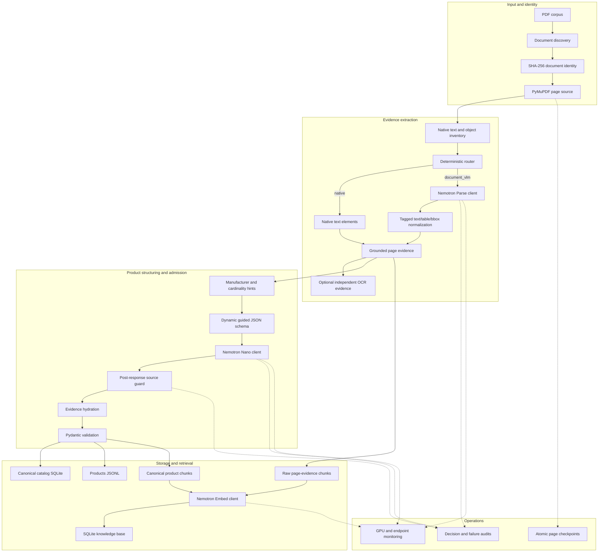
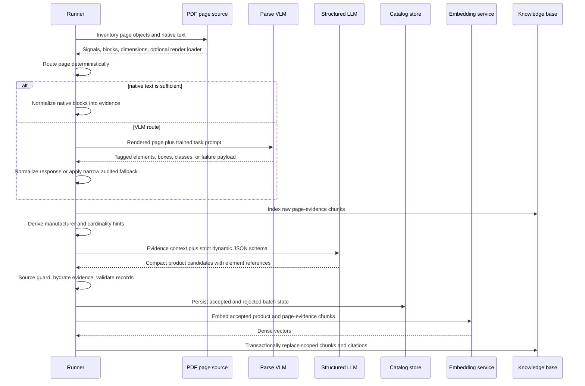
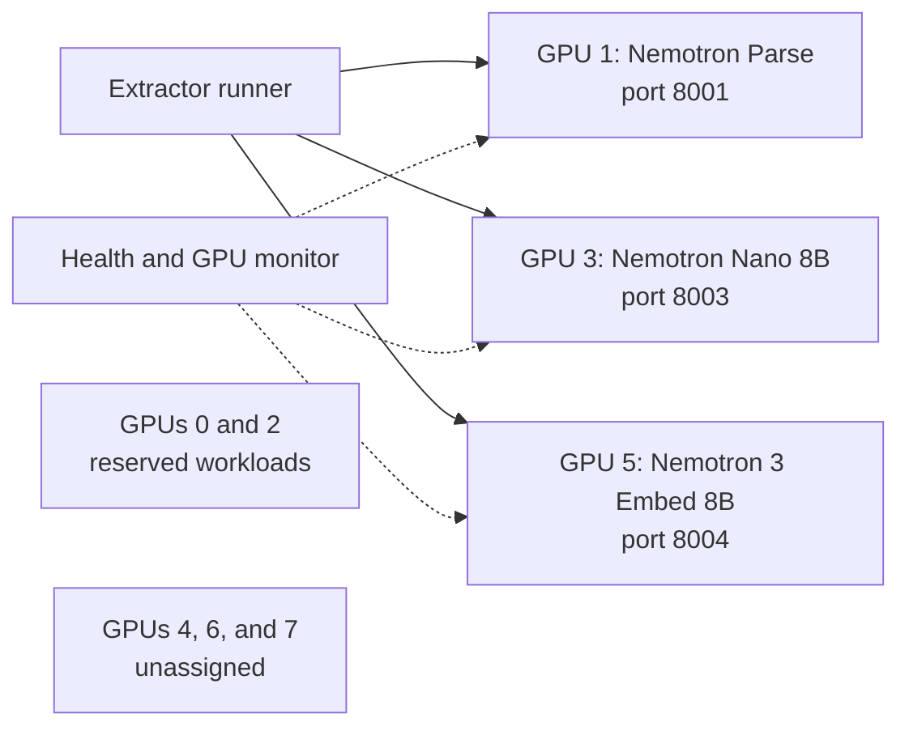

# Architecture

## 1. System purpose

The Industrial Catalog Extractor converts heterogeneous PDF catalogs into two
linked outputs:

1. A canonical product catalog containing only source-backed, validated records.
2. A retrieval knowledge base containing canonical product chunks and raw page
   evidence with exact citations.

The system assumes that industrial documents are structurally inconsistent and
that model output can be incomplete, malformed, or unsupported. Its main invariant
is therefore evidence preservation: every canonical value must remain traceable to
the exact source page and extraction element that supports it.

## 2. Design principles

### Evidence before interpretation

The page-extraction stage creates stable evidence elements before product parsing.
The structured LLM cites those element IDs instead of inventing free-form citations.
Trusted application code resolves the references back to canonical evidence.

### Deterministic controls around probabilistic models

Routing, blank-page certification, source hints, output schema, source guards,
validation, identifiers, checkpoints, and persistence are deterministic. Models
are used for document understanding and constrained semantic parsing, not for
admission policy.

### Fail closed

An HTTP 200 response is not automatically a successful inference. Blank or
unsupported assistant content is retried and audited. Unsupported claims,
cross-document references, ambiguous product cardinality, and unresolved nonblank
pages are rejected rather than silently accepted.

### Separate discovery from canonical truth

All successfully extracted page evidence can be searchable. Only validated product
records enter the canonical product tier. This makes rejected or unresolved pages
discoverable without promoting them to trusted catalog facts.

### Idempotent, inspectable state

Stable content identities, atomic page checkpoints, upserts, transactional chunk
replacement, and raw-response journals make bounded retries inspectable and reduce
duplicate output.

## 3. Component view



## 4. End-to-end sequence



## 5. Document identity and page source

The document identifier is derived from the source file SHA-256. PyMuPDF exposes
pages in ascending one-based order and inventories:

- native text and text blocks;
- page dimensions and block bounding boxes;
- detected tables and multi-column layout signals;
- raster-image coverage and embedded image count;
- vector drawings, annotations, and links;
- a lazy page renderer used only when image inference is required.

This inventory supports routing, certified blank detection, audit, and checkpoint
fingerprints without eagerly rendering every page.

## 6. Deterministic page routing

The router measures non-whitespace characters, words, lines, identifier-like
tokens, printable ratio, alphanumeric ratio, replacement-character ratio, table
signals, column layout, and raster coverage.

The validated default native-text quality floor is:

| Signal | Default threshold |
| --- | ---: |
| Non-whitespace characters | at least 80 |
| Words | at least 12 |
| Printable ratio | at least 0.95 |
| Alphanumeric ratio | at least 0.35 |
| Replacement-character ratio | at most 0.01 |

Table pages, multi-column pages, and pages with raster coverage at or above 0.45
route to the document VLM by default. Every route records measured signals and
ordered reason codes.

`native_min_chars_per_square_inch` is currently represented in configuration but
is not consumed by the router. It is documented as reserved rather than treated as
an active control.

## 7. NVIDIA Nemotron Parse integration

VLM-routed pages are rendered at the configured DPI and sent as base64 image URLs
to an OpenAI-compatible endpoint. The Parse v1.2 client uses the trained task
prompt:

```text
</s><s><predict_bbox><predict_classes><output_markdown><predict_no_text_in_pic>
```

The validated request profile uses deterministic sampling, an 8,192-token output
limit, `top_k=1`, repetition penalty 1.1, and special-token preservation.

The normalizer accepts:

- JSON objects or element arrays;
- tagged text, class, and normalized bounding-box output;
- a final document-text element for supported non-JSON text that cannot be split
  into tagged elements.

Parse bounding boxes are labeled as normalized coordinates. Native PyMuPDF boxes
retain page-coordinate values.

## 8. Semantic success, retries, and fallbacks

The shared endpoint client applies deterministic exponential retry without random
jitter. Transport failures and HTTP 408, 409, 425, 429, 500, 502, 503, and 504 are
retryable within the configured bound.

The response decoder recognizes message content, parsed objects, content blocks,
tool/function arguments, legacy completion text, reasoning-content fallbacks, and
Responses-style output. A successful response with no supported nonblank assistant
payload is recorded as `unsupported_assistant_content` and retried.

### Certified blank page

A page bypasses model inference only when a complete source-object inventory proves
that native text, native blocks, tables, raster coverage, embedded images, vector
drawings, annotations, links, multi-column layout, and preloaded image bytes are all
absent. Missing or invalid signals never count as proof of blankness.

A certified blank emits a stable `deterministic_blank_page` audit, no evidence
elements, no product-LLM request, and no ingestion batch.

### Native fallback after semantic exhaustion

Native fallback is allowed only when all of the following hold:

1. Parse exhausted successful HTTP responses with unsupported assistant content.
2. At least one successful raw provider response was retained.
3. The native text independently passes the normal native-quality policy after
   layout-only triggers are neutralized.

The original VLM route and all provider failures remain in the audit. Transport,
server, mixed, or unrelated parsing failures are not converted into native success.

## 9. Evidence contract

Each extracted element contains, when available:

- stable element ID;
- source document ID and path;
- one-based page and sequence number;
- semantic element type and exact text;
- extraction method and model;
- bounding box and coordinate-space metadata;
- confidence and provider metadata.

The element ID hashes the document, page, sequence, type, text, method, bounding
box, and model. This creates stable references for guided parsing, validation,
citations, and replay.

## 10. Structured product extraction

Pages are grouped into bounded parse chunks. Before LLM inference, deterministic
code derives:

- manufacturer candidates from explicit company labels, legal names, copyright
  lines, and brand/company evidence;
- product cardinality from explicit orderable table rows and identifier columns.

These hints alter the strict JSON Schema supplied to Nemotron Nano:

- known manufacturers and supporting element IDs become enumerations;
- ordinary prose chunks permit at most one product;
- distinct orderable rows require the exact source identifier set;
- part-number output is disabled when source structure is insufficient.

The wire object contains raw strings and compact `{element_id}` references. Trusted
code, rather than the LLM, supplies normalized values, canonical evidence objects,
stable IDs, confidence, and persistence metadata.

Malformed or truncated JSON receives at most one bounded regeneration request. All
attempts, finish reasons, raw payloads, and decode classifications remain auditable.

## 11. Source guard and validation

The post-response source guard repeats critical rules even if the provider reports
schema success. It checks manufacturer evidence, product cardinality, exact row
identifiers, required identity fields, and unsafe part-number claims.

Evidence hydration replaces compact references with canonical elements and rejects:

- unknown evidence IDs;
- cross-document references;
- claimed page or excerpt values that disagree with the canonical element;
- missing required evidence;
- malformed products, specifications, or details.

Valid sibling products are preserved when another product in the same batch fails.
Rejected products and raw model responses remain journaled for research audit.

## 12. Canonical data model and persistence

`ExtractedValue` stores lossless raw data separately from a trusted normalized value,
normalization method, confidence, and field-level evidence. A `ProductRecord`
contains manufacturer, part name, optional part number, specifications, other
details, provenance, version, confidence, and review state.

SQLite stores normalized product, specification, evidence, ingestion-batch,
accepted-link, and rejected-product tables. JSONL is an append-oriented exchange
view. Batch IDs exclude volatile provider request IDs and include source identity,
pipeline version, schema hash, extraction scope, and logical parsed content.

## 13. Two-tier RAG knowledge base

| Tier | Admission | Granularity | Intended use |
| --- | --- | --- | --- |
| `page_evidence` | Every nonblank element from successful page extraction | One chunk per element | Broad source discovery and audit |
| `product` | Accepted, validated product records only | Identity, specification, and operating-condition chunks | High-precision canonical retrieval |

Each chunk has a deterministic content identity and one or more citations containing
the document, page, element, exact excerpt, bounding box, confidence, and supporting
field path. Embedding completes before a replacement transaction, so a failed
embedding request does not erase the previously indexed owner scope.

The live profile prefixes indexed text with `passage: ` and queries with `query: `.
The current search implementation performs an exact cosine scan over vectors stored
as JSON in SQLite. This favors inspectability over large-scale performance.

## 14. Checkpoints and audit artifacts

The page fingerprint includes document and page identity, native text and block
structure, dimensions, source-object metadata, preloaded image hash, route decision,
and credential-free endpoint configurations. Checkpoints are written through a
temporary file, flushed, synchronized, and atomically replaced.

Restore requires matching fingerprint, document ID, and page. Failed pages are not
saved as successful checkpoints.

The runner writes extraction, structured-response, decision, validation, document,
chunk, summary, catalog, and knowledge-base artifacts. Raw provider responses may
contain copyrighted or sensitive source text and must be protected accordingly.

## 15. Deployment topology

The validated reference server had eight NVIDIA A100-SXM4 80 GB GPUs. The measured
assignment was:



The service launcher verifies PID ownership, model identity, port, physical GPU,
and health before adopting or starting a process. The assignment is site-specific;
the Python library can call any compatible endpoint configured in YAML.

## 16. Code map

| File | Responsibility |
| --- | --- |
| `routing.py` | Page signals and deterministic route decisions |
| `nvidia_clients.py` | Endpoint configuration, transport, retries, Parse/OCR/JSON clients |
| `extraction.py` | PDF page source, evidence extraction, source hints, blank/fallback policy |
| `models.py` | Canonical and guided-JSON Pydantic contracts |
| `validation.py` | Evidence hydration and product validation |
| `storage.py` | Canonical catalog and audit persistence |
| `knowledge_base.py` | Chunks, citations, embeddings, indexing, and retrieval |
| `checkpoints.py` | Document-level checkpoint state |
| `runner.py` | Bounded end-to-end orchestration and output artifacts |
| `cli.py` | Benchmark and query commands |

## 17. Implemented and planned boundary

Implemented now:

- deterministic routing and certified blank handling;
- Parse semantic retries and narrow native fallback;
- evidence-first guided parsing and source guard;
- canonical storage and two-tier citation-bearing RAG;
- content-sensitive checkpoints and bounded monitored runs;
- deterministic offline mode and focused automated tests.

Planned before a full-corpus claim:

- immutable campaign manifests and stable page-window work units;
- external shard workers with isolated state;
- page-range-safe knowledge-base replacement;
- deterministic, conflict-detecting shard merge;
- model revision and embedding-dimension enforcement;
- approximate/hybrid retrieval and evaluated reranking;
- general replay from stored provider responses.
