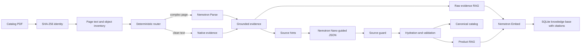

# NVIDIA Industrial Catalog Extraction Pipeline

## Detailed research and implementation report

**Release:** 0.1.0
**Report date:** 7 August 2026
**Status:** Validated bounded-run research prototype
**Affiliation:** Independent research project; not affiliated with or endorsed by NVIDIA

## Abstract

Industrial product catalogs mix embedded text, scans, tables, multi-column layouts,
drawings, part identifiers, units, and marketing prose. A conventional OCR-to-JSON
workflow frequently loses layout, merges products, or produces plausible but
unsupported fields. This project implements an evidence-preserving alternative on
NVIDIA GPU infrastructure. Pages are inventoried and routed deterministically;
complex pages are parsed by NVIDIA Nemotron Parse; extracted evidence is supplied
to Llama 3.1 Nemotron Nano under a dynamic strict JSON Schema; deterministic source
guards and Pydantic validation control admission; and accepted products plus raw
page evidence are embedded with Nemotron 3 Embed into a citation-bearing SQLite
knowledge base.

The validated environment used eight NVIDIA A100-SXM4 80 GB GPUs, approximately
2 TB of system memory, and separate services for document parsing, structured
language inference, and embeddings. A bounded 20-document validation produced
1,622 grounded elements, 31 stored products, and 1,655 knowledge chunks. A hardened
two-document replay completed 24 pages with zero failed documents and 531 exact-
citation evidence chunks. These results demonstrate bounded pipeline operation;
they do not constitute full processing of the 220-document, 17,837-page source
collection.

## 1. Research problem

The research question is not merely whether a model can read a catalog. The more
useful question is whether a system can transform heterogeneous catalogs into
structured, searchable product data while preserving enough provenance to audit,
reject, reproduce, and retrieve every accepted claim.

The implementation addresses four questions:

1. Can low-cost native PDF extraction be used when trustworthy without sacrificing
   visually complex pages?
2. Can a structured LLM be constrained by page evidence strongly enough to limit
   unsupported manufacturer, product-cardinality, and part-number claims?
3. Can rejected product pages remain useful for retrieval without contaminating a
   canonical product catalog?
4. Can model failures, retries, fallbacks, and checkpoints be represented as
   deterministic operational evidence rather than hidden control flow?

## 2. Contributions

The principal engineering contributions are:

- a deterministic page router combining native-text quality and visual-layout
  signals;
- a normalized evidence contract spanning native PDF text, document VLM output,
  and optional OCR verification;
- semantic retry handling that distinguishes transport success from usable model
  content;
- a positive blank-page certificate and a narrowly authorized native fallback;
- source-derived manufacturer and product-cardinality hints that alter the guided
  JSON Schema before LLM inference;
- an independent post-response guard that rechecks source constraints;
- evidence hydration and typed validation that preserve valid sibling records;
- a two-tier RAG design separating raw evidence discovery from canonical products;
- content-sensitive atomic checkpoints and deterministic storage identities;
- a bounded GPU operations profile with PID, port, model, health, and GPU ownership
  checks.

## 3. Pipeline architecture

Detailed component contracts and failure paths are documented in
[ARCHITECTURE.md](ARCHITECTURE.md).

## 4. NVIDIA resources

### 4.1 Model roles

| Role | Model | Function in this implementation |
| --- | --- | --- |
| Document VLM | `nvidia/NVIDIA-Nemotron-Parse-v1.2` | Structured page text, semantic classes, reading order, and grounded boxes |
| Structured LLM | `nvidia/Llama-3.1-Nemotron-Nano-8B-v1` | Evidence-constrained manufacturer, part identity, specification, and detail parsing |
| Embeddings | `nvidia/Nemotron-3-Embed-8B-BF16` | Passage and query vectors for citation-bearing retrieval |

Model capability statements should be read against the official upstream model
cards listed in [THIRD_PARTY_MODELS.md](../THIRD_PARTY_MODELS.md). Model weights are
not part of this software release.

### 4.2 Validated server profile

The measured host exposed eight NVIDIA A100-SXM4 GPUs with 80 GB of memory each,
for 640 GB total GPU memory. It also exposed approximately 2 TB system memory, 255
logical CPUs, and approximately 17.4 TB free durable storage at inspection time.

The service assignment was:

| Physical GPU | Service | Port | Status in the validated profile |
| ---: | --- | ---: | --- |
| 0 | Pre-existing workload | - | Reserved, outside project control |
| 1 | Nemotron Parse | 8001 | Active |
| 2 | Pre-existing workload | - | Reserved, outside project control |
| 3 | Nemotron Nano | 8003 | Active |
| 4 | None | - | Available |
| 5 | Nemotron Embed | 8004 | Active |
| 6 | None | - | Available |
| 7 | None | - | Available |

The server layout is a reproducibility profile, not a universal requirement.

## 5. Evidence extraction method

### 5.1 PDF inventory

PyMuPDF supplies native text, ordered blocks, dimensions, tables, image coverage,
columns, drawings, embedded-image count, annotations, links, and a lazy page-render
function. Rendering is deferred until a page actually needs image inference.

### 5.2 Route selection

Native extraction is preferred only when quantitative quality thresholds pass and
no high-priority visual-layout signal requires VLM interpretation. The retained
route object contains both the decision and the measured reasons, permitting later
audit or threshold research.

### 5.3 Parse output

The page image is submitted to an OpenAI-compatible Parse endpoint with the trained
task prompt and deterministic generation parameters. The normalizer converts JSON,
tagged Parse output, or supported text into a common evidence-element model.

### 5.4 Optional OCR

OCR is modeled as a separate verifier. It contributes additional evidence rather
than replacing native or Parse evidence. The validated default deployment did not
start an OCR endpoint, so OCR accuracy is outside the reported experiment.

## 6. Structured parsing and evidence admission

The model receives an ordered evidence context and emits compact references. It
does not directly write trusted normalized values or final provenance.

Manufacturer hints come from explicit legal, copyright, label, brand, and company
evidence. Cardinality hints require explicit orderable identifiers in table-like
source structure. The system then builds a dynamic strict schema:

- a single-family page permits at most one product and can disable part number;
- a multi-row page requires one identity product for every exact source identifier;
- known manufacturer values and evidence IDs become finite schema choices;
- unknown fields and unexpected object properties are rejected.

After inference, the source guard independently checks the same invariants. This
defense is necessary because provider-side structured output constrains shape but
does not prove that a value is supported by the source.

Evidence hydration resolves every element reference and verifies document, page,
and excerpt consistency. Pydantic models validate canonical types. Accepted and
rejected siblings are handled separately, and the full raw batch remains auditable.

## 7. Knowledge-base design

### 7.1 Raw page-evidence tier

Every nonblank evidence element from a successfully completed page becomes a
retrieval chunk. This preserves search access even when a page does not meet product
eligibility or its product candidate is rejected.

### 7.2 Canonical product tier

Accepted products produce identity, specification, and operating-condition chunks.
Each citation retains exact source text, document, page, element ID, optional box,
confidence, and the field paths it supports.

### 7.3 Embeddings and retrieval

The NVIDIA embedding adapter applies `passage: ` and `query: ` prefixes, batches
requests, reorders responses by provider index, and rejects nonfinite or inconsistent
vectors. The current store records model and dimension and uses exact cosine ranking
over SQLite JSON vectors. Text-only substring retrieval is available for offline
inspection.

## 8. Resilience mechanisms

### 8.1 Semantic retry

Successful HTTP responses with blank or unsupported assistant content are treated
as inference failures. The full responses are recorded and retried under the same
bounded deterministic policy. Mixed transport and semantic failure sequences are
classified separately.

### 8.2 Certified blanks

A blank decision requires positive zero-valued evidence for every relevant source
object class. Unknown state is not blank state. Certified blank pages skip product
parsing and persistence while retaining a stable audit event.

### 8.3 Native fallback

Fallback after Parse exhaustion is limited to successful-but-unusable Parse content
and independently quality-approved native source text. It does not hide transport,
server, or image-only failures.

### 8.4 Checkpoints

Page checkpoints include content, route, and credential-free configuration signals.
Writes are atomic, and restore requires an exact fingerprint match. A failed page is
never recorded as a successful checkpoint.

## 9. Experimental material

The inspected source collection contained:

| Campaign | PDFs | Pages | Intended profile |
| --- | ---: | ---: | --- |
| Vendor product catalogs | 110 | 6,069 | Product and specification extraction |
| Industrial reference library | 110 | 11,768 | Separate reference-document profile |
| Combined inventory | 220 | 17,837 | Two campaigns, optionally merged later |

The PDFs are not redistributed. They may be copyrighted and are outside the code
license. Exact corpus reproduction requires authorized access to the original files.

## 10. Measured validation results

### 10.1 Bounded production validation

Run `20260807T064527Z-971750` reported:

| Metric | Value |
| --- | ---: |
| Documents attempted | 20 |
| Documents completed with review warnings | 18 |
| Documents failed | 2 |
| Counted pages in successful/review documents | 105 |
| Extracted elements | 1,622 |
| Product candidates parsed | 73 |
| Candidates rejected by source guard | 41 |
| Products stored | 31 |
| Products invalid after validation | 1 |
| Knowledge-base chunks | 1,655 |
| Elapsed time | 828.999771 seconds |

`review` means completed with accepted output and quality warnings. It is not the
same as an execution failure.

The observed aggregate rate was approximately 7.6 counted pages per minute. Failed
document processing time is present in elapsed time while failed-document pages are
not present in the page counter, so this is not a clean service-level benchmark.

### 10.2 Hardened incident replay

Run `20260807T073659Z-1185130` replayed the two earlier failures after resilience
hardening:

| Metric | Value |
| --- | ---: |
| Documents | 2 review, 0 failed |
| Pages | 24 |
| Extracted elements | 531 |
| Ingestion batches | 23 |
| Stored products | 0 |
| Knowledge chunks | 531 |
| Citations | 531 |
| Elapsed time | 85.468255 seconds |

On one page, Parse returned eight successful-but-empty responses. The system then
used 25 quality-approved native blocks while retaining the original VLM failure
audit. On the other document, one page was positively certified blank and therefore
created no evidence or product-ingestion batch. The single product candidate in the
replay was rejected by the deterministic source guard; no unsupported product
entered the canonical catalog.

Both replay SQLite databases were reported as passing integrity and foreign-key
checks. The remote run databases are not included in this repository, so that
integrity statement is operational evidence rather than independently re-executed
public evidence.

## 11. Interpretation

The bounded results support the following conclusions:

- deterministic routing can combine native and VLM evidence within one document;
- semantic-response validation catches a class of failures hidden by HTTP status;
- a narrow source-quality fallback can recover usable evidence without converting
  unrelated failures into success;
- source guards prevent at least some schema-valid but unsupported product records;
- a raw evidence tier preserves retrieval utility when canonical admission fails;
- exact citations can be retained through extraction, indexing, and retrieval.

They do not establish extraction precision or recall on the entire corpus, field-
level semantic correctness, or production throughput under parallel load. A labeled
ground-truth evaluation set is still required.

## 12. Limitations and threats to validity

### Internal validity

- The bounded sample was not described as a randomized corpus sample.
- Aggregate throughput includes failed-document time but excludes those pages from
  its page denominator.
- OCR was inactive in the validated service profile.
- Some results derive from retained operational summaries rather than public raw
  databases.

### Construct validity

- Stored-product count is not a direct accuracy measure.
- Schema validity and evidence presence do not generally prove semantic entailment
  for every extracted specification.
- Retrieval chunk count is not a measure of retrieval quality.
- A successful exact-citation join does not guarantee that the excerpt supports the
  claimed normalized interpretation.

### External validity

- Results were measured on one corpus family and one eight-A100 server.
- Reference-library documents differ from vendor catalogs and need a separate
  profile and pilot.
- Model revisions, serving engines, CUDA versions, and endpoint configuration may
  materially change output.

### Current engineering limits

- Worker-count settings are not consumed; the runner is sequential.
- Manifest-pinned full-corpus sharding and deterministic merge are not implemented.
- Page-evidence replacement is not page-window safe.
- JSONL publication is not transactionally coupled to SQLite.
- Reprocessing lacks a complete supersession/tombstone release model.
- Product identity retains some model-output ordering sensitivity.
- Embedding model and 4,096-dimensional output are recorded but not enforced as a
  release-wide invariant.
- Vector retrieval is a full scan without ANN indexing, hybrid fusion, reranking,
  or a labeled retrieval evaluation.
- The knowledge base retrieves chunks; it does not synthesize a grounded answer.

## 13. Production-scale roadmap

Before claiming a completed corpus campaign, the implementation needs:

1. Immutable corpus manifests with relative path, SHA-256, byte size, and page count.
2. Stable nonoverlapping page-window work units with isolated attempt state.
3. Balanced external shards and measured shared-endpoint concurrency.
4. Page-range-safe indexing and checkpoint identities.
5. Deterministic database merge with conflict detection and foreign-key ordering.
6. Release gates for manifest coverage, no page gaps/overlaps, database integrity,
   citation reconciliation, and one embedding model/revision/dimension.
7. Deterministic release JSONL generated from canonical SQLite state.
8. A labeled evaluation set for field accuracy, citation support, retrieval recall,
   and source-guard error analysis.

## 14. Data governance and ethics

Industrial catalogs may contain copyrighted text, personal contact information,
controlled technical detail, or safety-critical values. Users should process only
authorized documents, protect raw provider payloads and databases, and avoid
publishing source-derived text or embeddings without a rights assessment.

The system is not a safety certification tool. Domain experts should review values
used for procurement, engineering, maintenance, regulatory, or physical-safety
decisions. Model confidence must not replace evidence review.

## 15. Reproducibility statement

This repository supports three levels of reproduction:

1. **Offline software reproduction:** synthetic PDF, deterministic clients, tests,
   package build, storage, and text retrieval without a GPU.
2. **Live model reproduction:** user-supplied authorized PDFs and compatible pinned
   NVIDIA endpoints; output may vary with model/runtime revision.
3. **Exact experiment reproduction:** requires the unavailable source corpus,
   immutable manifests, exact model revisions, environment snapshots, and retained
   run artifacts.

Commands and release checks are in [REPRODUCIBILITY.md](REPRODUCIBILITY.md).

## 16. Conclusion

The project demonstrates an operational pattern for industrial document AI in which
models propose interpretations but deterministic evidence policy controls trust.
The most important outcome is not the number of JSON records; it is the preservation
of a reviewable chain from every accepted or retrieved value back to the page
evidence that produced it. The bounded validation and incident replay support that
architecture while leaving full-corpus execution and statistical accuracy
evaluation as explicit future work.

## References

- [NVIDIA Nemotron Parse v1.2 model card](https://huggingface.co/nvidia/NVIDIA-Nemotron-Parse-v1.2)
- [Llama 3.1 Nemotron Nano 8B v1 model card](https://huggingface.co/nvidia/Llama-3.1-Nemotron-Nano-8B-v1)
- [Nemotron 3 Embed 8B BF16 model card](https://huggingface.co/nvidia/Nemotron-3-Embed-8B-BF16)
- [Operations and scale plan](operations-and-scale-plan.md)
- [Repository architecture](ARCHITECTURE.md)
